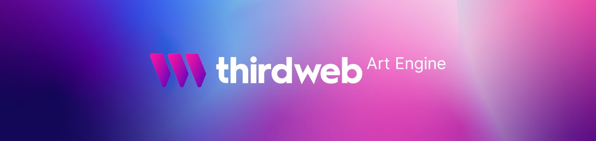

# The thirdweb Art Engine [](https://github.com/warengonzaga/awesome-thirdweb)

[](https://github.com/warengonzaga) [](https://github.com/warengonzaga/thirdweb-art-engine/releases) [](https://github.com/warengonzaga/thirdweb-art-engine/stargazers) [](https://github.com/warengonzaga/thirdweb-art-engine/blob/main/license)

[](https://github.com/warengonzaga/thirdweb-art-engine)

The forked version of [HashLips Art Engine](https://github.com/HashLips/hashlips_art_engine) with better features and compatibility with [thirdweb](https://thirdweb.com).

Generative photography project that harnesses the serendipity of on-chain mechanics to compose unique one of a kind NFTs. Each piece is a unique combination of five core layers and additional special layers.

# Creator Studio

Under the guidance of esteemed photographers and curators, Ikigai Labs operates as an onchain art gallery and auction house. Artists can leverage our assistance in digitizing their masterpieces, fabricating exquisite onchain collectibles that mirror their tangible art, and obtain personalized support in minting their distinctive creator contracts. Artists can also chronicle their artistic journey on the Editorial. Creators have the freedom to decide whether to mint a one-off (ERC721) or multiple (ERC1155) copies of their artwork. The Creator Studio grants priority access to meticulously curated collections. Through our team of creators and curators, we strive to produce captivating and thought-provoking works of art that challenge conventional norms and ignite the imagination. From fine art to pixel art, photography to generative art, and AI-inspired creations, we explore the full spectrum of artistic mediums, always pushing the envelope of what is possible.

# Collectors Bar

The Collectors Bar is boasting a curated collection from distinguished creators. Our emphasis is on curation by the iconic Florence Moll to nurture a fine art collection for Season One of our journey. Ikigai Labs offers an open forum for creators and ccurators to immerse collectors in transformative experiences. Our purpose includes utilizing a portion of secondary royalties to collaborate with creators and commission them for exclusive mints. We recognize the intrinsic value of art as a form of cultural heritage and personal expression. As collectors ourselves, we appreciate the beauty and significance of acquiring and preserving artworks that resonate with us. At Ikigai Labs, we actively engage in collecting fine art, pixel art, photography, generative art, and various other mediums. Through our collections, we celebrate the vision and talent of artists while nurturing a vibrant art ecosystem.

# Curators Pool

As passionate art enthusiasts, we understand the value of curation in connecting artists and collectors. Our curatorial team diligently seeks out the most exceptional and groundbreaking artworks, curating collections that transcend the ordinary and evoke a sense of wonder. With a discerning eye for quality and a commitment to showcasing diverse artistic voices, Florence Moll & Dimitri Daniloff curated exhibitions and collections that foster connections between artists, collectors, and the onchain art community. The members of this IKIGAI LABS Art Collective, believe that a curator-centric approach is crucial and that curators play an essential role in shaping the direction of the collective and ensuring that the art we showcase is of the highest quality. Therefore, we pledge to prioritize the role of the curator in our collective.

# Founders Club

The Founders Club is your gateway to exclusive events, private auctions, and gallery inaugurations. The pass ensures priority access to mints from our lineup of legendary and up-and-coming artists. As a company, our true North Star is the realization of our art gallery – a physical space that embodies our commitment to art and creativity. Overlooking the majestic ocean, our art gallery will serve as a permanent workshop, a sanctuary for creative minds, and a hub for artistic exploration. It will be a space where artists and art lovers converge, where ideas are born, and where art finds its truest expression. The gallery will be a testament to our dedication to fostering artistic excellence and creating an environment that nurtures the imagination.

## ⚡ Instant Setup

Let's get started with the instant setup and build. Proceed to the requirements below.

### 📋 Requirements

- A [GitHub Account](https://github.com/signup).
- A [Gitpod Account](https://gitpod.io). (sign up with GitHub)
- Image layers for your NFTs.

[](https://gitpod.io/#github.com/warengonzaga/thirdweb-art-engine)

## 🤔 What's New

These are the few important improvements to the forked version of art engine that will work 100% with thirdweb NFT project deployments.

### ✅ Generate thirdweb Folder

You can now generate a folder where you can use to drag and drop it to the thirdweb dashboard. You can only run this after you generated your arts via `yarn generate` command. Use the command below to generate a folder for you to use in thirdweb dashboard.

```bash
$ yarn generate_thirdweb
```

If you want to generate the art and create a folder for thirdweb at the same time follow the command below.

```bash
$ yarn generate && yarn generate_thirdweb
```

> **Why not add this to script command?**
> For some reason it is not working on my end, need to update this and bind it on the `yarn generate` script.
> For now, you can use the command above. ✌️

### ✅ Start Count From

You can define your own start count upon generation. Default count is 0. This is to match the default minting token ID with thirdweb.

By default it is `0`.

```js
const startCountFrom = 0;
```

### ✅ Local File Mapping

You can define your own file mapping, you can choose between local file mapping or use the existing pre-uploaded file on IPFS. Make sure to make the `hasBaseUri` to `true` so that the engine will use the defined `baseUri` in the config file.

By default it is `false`.

```js
const hasBaseUri = false;
const baseUri = "ipfs://cid-here";
```

If set to `false` the output would be...

```json
"image": "0.png",
```

If set to `true` the output would be...

```json
"image": "ipfs://<cid-here>/0.png",
```

### ✅ Case Sensitivity

Use only this option if you want to make your layer image filename to case sensitive as trait value or case insentive and make your layer image filename to capitalize instead. By default, set to `false`.

```js
const isLayerNameFileNameAsIs = false;
```

#### Case Sensitive Example

> input: "**AWESOME**#1.png" as layer image filename.
> output: "_AWESOME_" as trait value.

#### Case Insensitive Example

> input: "**AWESOME**#1.png" as layer image filename.
> output: "_Awesome_" as trait value.

## 🐛 Issues

If you're facing a problem in using The thirdweb Art Engine please let me know by [creating an issue here](https://github.com/warengonzaga/thirdweb-art-engine/issues/new) or joining the official [thirdweb discord](https://discord.gg/thirdweb) server and mention me there. I'm here to help you!

## 📋 Code of Conduct

Read the project's [code of conduct](./code_of_conduct.md).

## 📃 License

The thirdweb Art Engine is licensed under [The MIT License](https://opensource.org/licenses/MIT).

## 🍀 Sponsor

> Love what I do? Send me some [love](https://github.com/sponsors/warengonzaga) or [coffee](https://buymeacoff.ee/warengonzaga)!? 💖☕
>
> Can't send love or coffees? 😥 Nominate me for a **[GitHub Star](https://stars.github.com/nominate)** instead!
> Your support will help me to continue working on open-source projects like this. 🙏😇

## 📝 Author

The thirdweb Art Engine is forked and maintained by **[Waren Gonzaga](https://github.com/warengonzaga)**, with the help of awesome [contributors](https://github.com/warengonzaga/thirdweb-art-engine/graphs/contributors).

[](https://github.com/warengonzaga/thirdweb-art-engine/graphs/contributors)

---

💻💖☕ by [Waren Gonzaga](https://warengonzaga.com) | [He is Awesome](https://www.youtube.com/watch?v=HHrxS4diLew&t=44s) 🙏

yarn generate
yarn rarity
yarn preview
